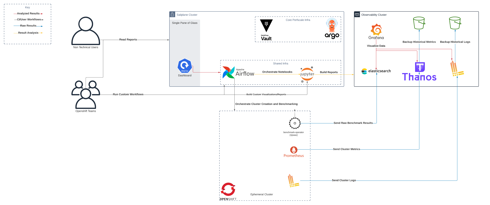

# Performance and Scale Platform (PSP)

The Performance and Scale Platform defines the core infrastructure for the Openshift Performance and Scale Team. This repo is meant to host the configurations of any long-term deployables used by the team


# Overview

Generally, the platform is used to enable running performance tests against a variety of OpenShift variants by providing crucial automation and monitoring infrastructure. A top-down view of this platform looks something like


 


 In the above diagram, we've decided to deploy different parts of the platform in different openshift clusters for multiple reasons. However, this is not required as you can deploy the entire platform in a single cluster if desired. In fact, we deploy the entire platform into the observability cluster, but we simply don't use the underlying infra in that cluster to keep our secrets/workflows in an internal cluster and not in a public facing one.  

# Stacks/Clusters

The platform is split largely into two separate stacks: `perfscale` and `observability`. Perfscale encapsulates the core automation infrastructure, while observability refers to the core monitoring infrastructure. Both stacks are deployed by [ArgoCD](https://argo-cd.readthedocs.io/en/stable/). The perfscale stack also configures argo to be self-managed, so we recommend always installing the perfscale stack for that reason. 

## Perfscale

The perfscale stack is comprised of a few main components:

* ArgoCD: Self managed version of ArgoCD to allow configuring it through GitOps similar to other components
* Airflow: Used to run workflows (this is what builds openshift clusters and runs the performance tests)
* Vault: Stores secrets for Airflow 
* Dashboard: In-house dashboard for viewing performance tests (development in ice-box atm)


## Observability

The observability stack is comprised of: 

* Elastic Operator: Supports and managed Elastic CRDs
* ElasticSearch/Kibana: Configured instance of ES/Kibana to store performance results
* Thanos: Used to store metrics from tested clusters or any other openshift/k8s cluster.
* Loki: Used to store logs from tested clusters or any other openshift cluster.
* Promtail: Configured instance of promtail to send logs from the cluster to Loki (used only for logs from the cluster the stack is installed on)
* Grafana: Used to Visualize the data within Loki/Thanos/Elasticsearch

## Clusters

The `cluster` directory contains yaml files meant to be applied to specific clusters in order to bootstrap them with the appropriate stacks. For the Performance and Scale team we have two clusters: `sailplane` and `observability` which are defined by the similarly named files. 


# Installing

> Note: This should only be done on fresh clusters, or when changing any related yaml in the `clusters` directory. Changes to anything else are automatically applied via ArgoCD.

To install the perfscale stack, you can use the `scripts/build.sh` script. This requires you to have a kubeconfig configured to the cluster you wish to install these apps into. 

Examples:

```bash

# This will make your cluster look like our sailplane cluster (core perf infra)
# -w flag will make the script wait for apps to be healthy
./scripts/build.sh -c sailplane -w

# This will make your cluster look like our observability cluster (ArgoCD + observability infra)
# no -w flag means the script will just apply the yaml and exit. 
./scripts/build.sh -c observability
```


After installing, you should see related info printed out to STDOUT. If you wish to see that info again, you can simply rerun `scripts/get_cluster_info.sh` to get routes/login info about apps deployed by this repo. 

